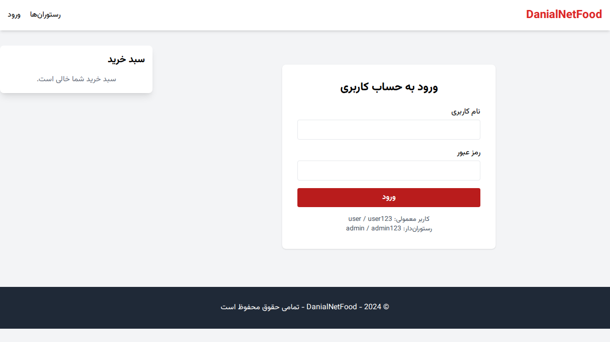

# سامانه یکپارچه سفارش غذا DanialNetFood

دانیال نت فود یک پلتفرم جامع سفارش آنلاین غذا است که بر پایه معماری ASP.NET Core MVC توسعه یافته است. این پروژه بر مدیریت سمت سرور، الگوهای طراحی سازمانی و تجربه کاربری پویا با فونت فارسی وزیرمتن تمرکز دارد.

## ویژگی‌های کلیدی
- مدیریت سبد خرید با استفاده از Session و بروزرسانی AJAX (بدون رفرش صفحه).
- سیستم تخفیف هوشمند با استفاده از الگوی طراحی Strategy.
- ردیابی زنده وضعیت سفارش با استفاده از SignalR.
- معماری لایه‌بندی شده با الگوهای Repository و Unit of Work.
- لایوت‌های مجزا برای بخش عمومی و پنل مدیریت رستوران.
- استفاده از فونت فارسی وزیرمتن (Vazirmatn) به صورت بومی.
- پشتیبانی از چندین دیتابیس (SQLite, SQL Server, PostgreSQL).
- آماده اجرا در Docker.

## پشته فنی
- بک‌آند: .NET 10 (ASP.NET Core MVC)
- دیتابیس: پشتیبانی از SQLite (پیش‌فرض)، SQL Server و PostgreSQL
- فرانت‌آند: Tailwind CSS, jQuery, SignalR JS Client, Vazirmatn Font

## راهنمای راه‌اندازی

### پیش‌نیازها
- نصب .NET SDK نسخه 10 یا استفاده از Docker

### مراحل اجرا (روش مستقیم)
1. مخزن را کلون کنید.
2. به پوشه `DanialNetFood.Web` بروید.
3. فایل `appsettings.json` را برای انتخاب دیتابیس تنظیم کنید:
   - `DatabaseProvider`: "Sqlite" یا "SqlServer" یا "PostgreSQL"
   - `ConnectionStrings:DefaultConnection`: رشته اتصال مربوطه
4. دستور `dotnet run` را اجرا کنید.
5. دیتابیس به صورت خودکار ایجاد و با داده‌های اولیه پر می‌شود.

### اجرا با Docker
1. در ریشه پروژه دستور زیر را اجرا کنید:
   ```bash
   docker-compose up --build
   ```
2. برنامه روی پورت `8080` در دسترس خواهد بود.

### اطلاعات ورود پیش‌فرض
- ادمین (رستوران‌دار): نام کاربری `admin` رمز عبور `admin123`
- مشتری: نام کاربری `user` رمز عبور `user123`

## تصاویر پروژه




## ساختار پوشه‌بندی
- `Controllers`: منطق کنترل درخواست‌ها (شامل AdminController و AccountController)
- `Models`: مدل‌های داده و ViewModels
- `Data`: مدیریت دیتابیس، مخازن و واحد کار (Unit of Work)
- `Services`: استراتژی‌های محاسبه تخفیف
- `Hubs`: هاب SignalR برای ارتباطات بلادرنگ
- `wwwroot/fonts`: فونت‌های بومی وزیرمتن
