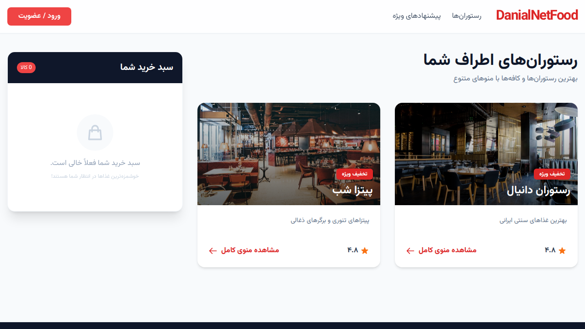
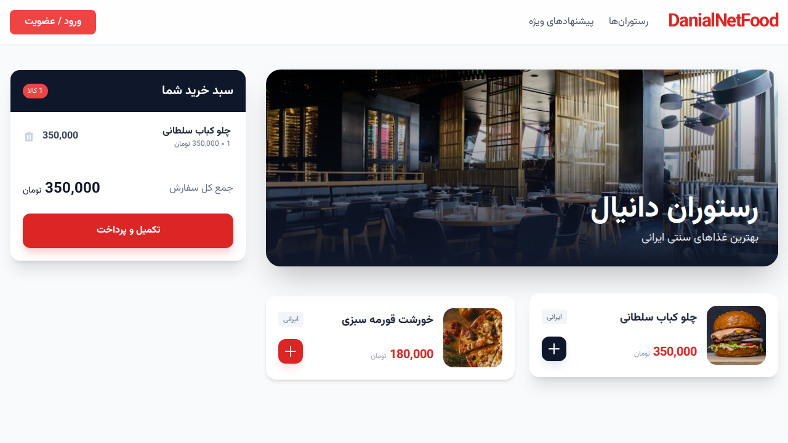
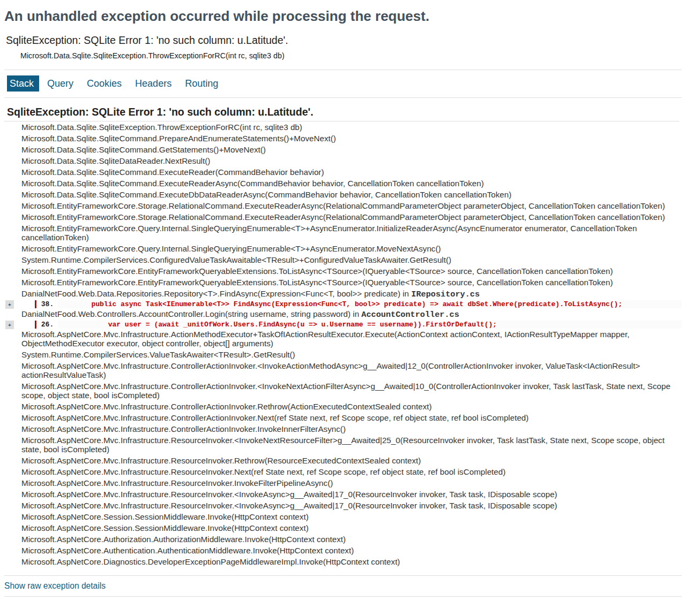
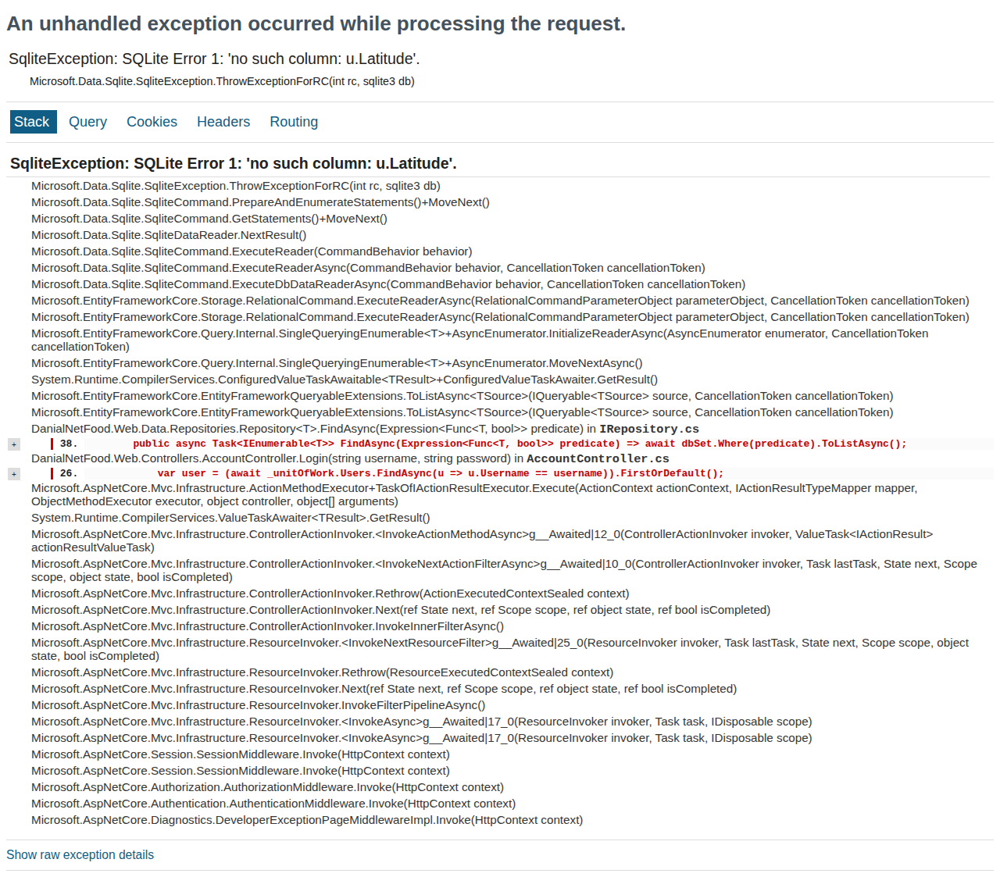

# سامانه جامع DanialNetFood

سامانه DanialNetFood یک پلتفرم یکپارچه (Monolith) برای مدیریت و سفارش غذا است که با استفاده از تکنولوژی‌های مدرن دات‌نت و با تمرکز بر عملکرد بالا و تجربه کاربری بومی طراحی شده است. این پروژه نمایشی از تسلط بر چرخه زندگی درخواست‌ها در ASP.NET Core MVC، مدیریت نشست‌های ایمن، و تعاملات آنی با SignalR است.

## ویژگی‌های کلیدی

*   **مدیریت سبد خرید هوشمند:** استفاده از AJAX و Session برای مدیریت سبد خرید بدون نیاز به رفرش صفحه.
*   **معماری چند لایه‌ای:** جداسازی کامل بخش‌های عمومی، پنل مدیریت رستوران، پنل سفیران (پیک) و پنل مدیریت کل (Super Admin).
*   **ردیابی آنی سفارشات:** پیاده‌سازی SignalR برای اطلاع‌رسانی لحظه‌ای تغییر وضعیت سفارش به مشتری و رستوران.
*   **سیستم تخفیف داینامیک:** استفاده از Strategy Pattern برای اعمال انواع تخفیف‌های درصدی و مبلغ ثابت.
*   **امنیت پیشرفته:** استفاده از Cookie Authentication و هش‌گذاری گذرواژه‌ها با الگوریتم BCrypt.
*   **قابلیت‌های سازمانی:** مدیریت کیف پول کاربر، سیستم بررسی محدوده جغرافیایی (Geofencing) و سوئیچ توقف اضطراری (Kill Switch).

## تکنولوژی‌های مورد استفاده

*   **Back-end:** ASP.NET Core 8.0 MVC, Entity Framework Core
*   **Database:** PostgreSQL (Production) / SQLite (Local)
*   **Real-time:** ASP.NET Core SignalR
*   **Front-end:** Tailwind CSS (Local), jQuery, Chart.js (Local)
*   **Fonts:** Vazirmatn (بومی‌سازی شده)

## راهنمای راه‌اندازی

۱. **پیش‌نیازها:**
   - نصب .NET 8.0 SDK
   - نصب Docker (در صورت استفاده از حالت Production)

۲. **اجرای پروژه به صورت محلی:**
   ```bash
   dotnet build
   dotnet run --project DanialNetFood.Web
   ```
   پس از اجرا، دیتابیس به صورت خودکار ساخته شده و داده‌های اولیه (Seeding) شامل رستوران‌ها، غذاها و کاربران تست وارد می‌شوند.

۳. **اطلاعات کاربران پیش‌فرض:**
   - **مدیریت کل:** `admin` / `123456`
   - **رستوران‌دار:** `owner` / `123456`
   - **سفیر:** `driver` / `123456`
   - **مشتری:** `customer` / `123456`

## اسکرین‌شات‌های سامانه

### صفحه اصلی و لیست رستوران‌ها


### منوی رستوران و سبد خرید شناور


### پنل مدیریت رستوران و پیگیری زنده سفارشات


### داشبورد آنالیز فروش (مدیریت کل)


## ساختار پروژه

*   **Controllers:** مدیریت منطق درخواست‌ها و هدایت بین ویوها.
*   **Models:** تعاریف موجودیت‌های دیتابیس و ViewModelها.
*   **Data:** شامل DbContext، الگوهای Repository و Unit of Work.
*   **Services:** سرویس‌های زیرساختی مانند کیف پول، مکان‌یابی و قیمت‌گذاری.
*   **Hubs:** مدیریت ارتباطات SignalR.
*   **wwwroot:** فایل‌های استاتیک شامل فونت‌ها، اسکریپت‌ها و تصاویر (بدون وابستگی به CDN).
